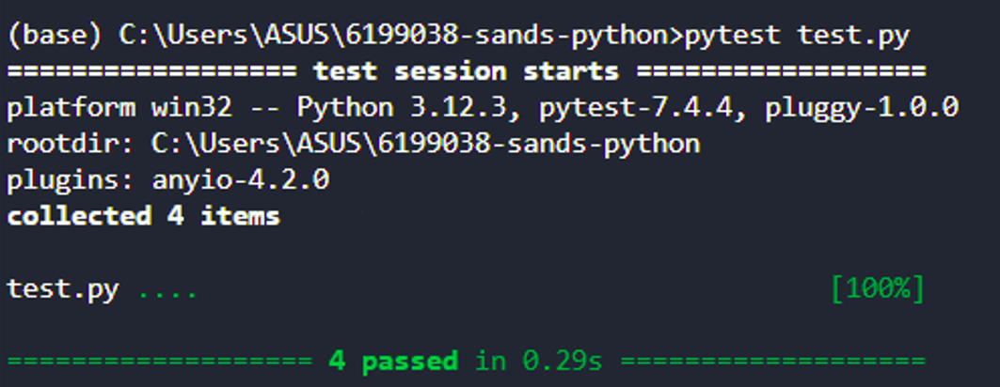

# Signals and Systems

This repository represents the project completed for the **Signals and Systems AESB2122-24** course.

---

## Table of Contents

1. [Introduction](#Introduction)
2. [Content](#Content)
3. [How to install](#How-to-install)
4. [How to use](#How-to-use)

---

## Introduction

The project focuses on generating basic signals using functions in Python to plot and analyze different types of signals, such as sine wave and unit step functions. These are then also modified and tested. 

---

## Content

This repository contains the following:

- `hello.py` – First print statement, testing 
- `Signals.py` – Defines the signals (`generate_u`and `generate_sin_wave`)  
- `Run.py` – Modifies and plots the signals   
- `README.md` – Presents the project 

---

## How to install

1. Download the project:
    ```git clone https://github.com/arieureka2023-del/6199038-sands-python.git```
2. Open the folder:
    ```cd 6199038-sands-python```
3. Install required modules (numpy and matplotlib):
    ```pip install``` 

---

## How to use

1. Run the program:
    ```python Run.py```

    This will open plots for the sin wave function and the unit step function as well as their modified versions.
    
2. Run the tests (optional):
    ```python -m pytest```

    These tests have the goal to check weather the functions work as theyìre supposed to. In case they do, the terminal will show the following:
    

